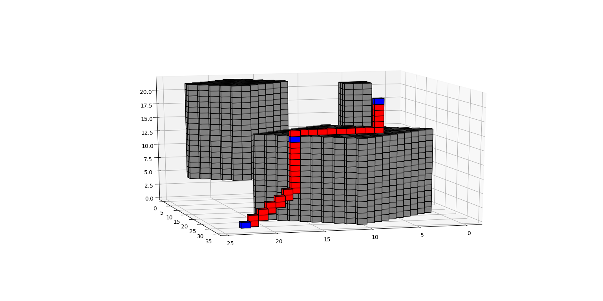

# path-planning-in-3D-env


# OverView
This project can generate discrete waypoints in a 3D discrete environment.
This project is based on these resources:
1. [jotredi/3D_Motion_Planning](https://github.com/jotredi/3D_Motion_Planning), fixed bugs of offset in Z-axis leading to incomplete calculation.

# How to Run
```
python motion_planning.py
```