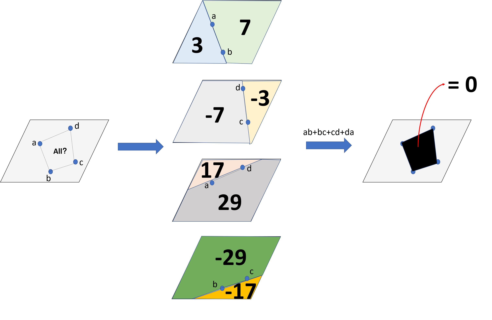

# path-planning-in-3D-env


# OverView
This project can generate discrete waypoints in a 3D discrete environment.
This project is based on these resources:
1. [jotredi/3D_Motion_Planning](https://github.com/jotredi/3D_Motion_Planning)

Note: The way to descripe the obstacles is changed to support non-rectangle obstacles.

# How to Run
```
python motion_planning.py
```

# A subAlgorithm: find all the points inside the four given points
The method is described below.
